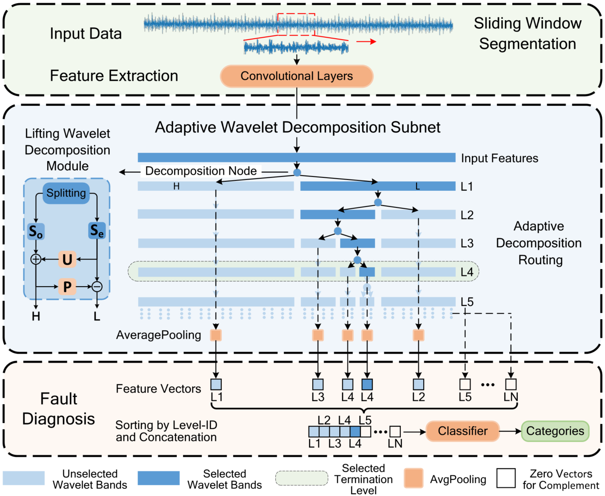

# AWD-Net
This is the project of manuscript AWD-Net: Adaptive Wavelet Decomposition Network for Rotating Machinery Fault Diagnosis Under Noisy Environment, Ye Zhang, Aosheng Tian, Chao Ma, Shilin Zhou and Yulan Guo. **Our team will release more interesting works and applications on time series analysis. Please keep following our repository.**



## Algorithm Introduction

This paper proposes an **A**daptive **W**avelet  **D**ecomposition **Net**work (**AWD-Net**) for rotating machinery fault diagnosis under noisy environment.  The experimental results on three public datasets with  different noise intensities demonstrate the effectiveness of  the proposed method. The contributions of this paper are summarized as follows:

- We propose AWD-Net for rotating machinery fault diagnosis under noisy environment, which comprises a lifting  wavelet decomposition module and an adaptive wavelet  decomposition routing.
- We design a lifting wavelet decomposition module, which  enhances the data adaptability of wavelet filters.
- We construct an adaptive wavelet decomposition routing,  which effectively separates the noise components from  the fault-related parts.
- Our proposed AWD-Net achieves superior anti-noise  performance on three public fault diagnosis datasets. Besides, the insightful analyses further demonstrate the  effectiveness of our method.

## Prerequisite

Tested on Ubuntu 22.04, with Python 3.8, PyTorch 1.12, CUDA 11.3, and 1x NVIDIA 2080Ti.

## Usage

On Ubuntu:

```
Click on main.py and run it. Adjust the hyperparameters in the constant file.
```

Or:

**(1) Train.**

```python
python main.py --PATTERN TRAIN --DATASETS CWRU_10 --CLASSIFIERS_all AWD_Net --BATCH_SIZE 64 --EPOCH 200 --LR 0.01 --CV_SPLITS 5 --test_split 20
```

**(2) Test.**

After the training process, we can use the following command for testing.

```
python main.py --PATTERN TEST --DATASETS CWRU_10 --CLASSIFIERS_all AWD_Net --test_split 20
```

## Other Explanations

Limited by storage space, we only upload the CWRU_10 dataset in the project.


  